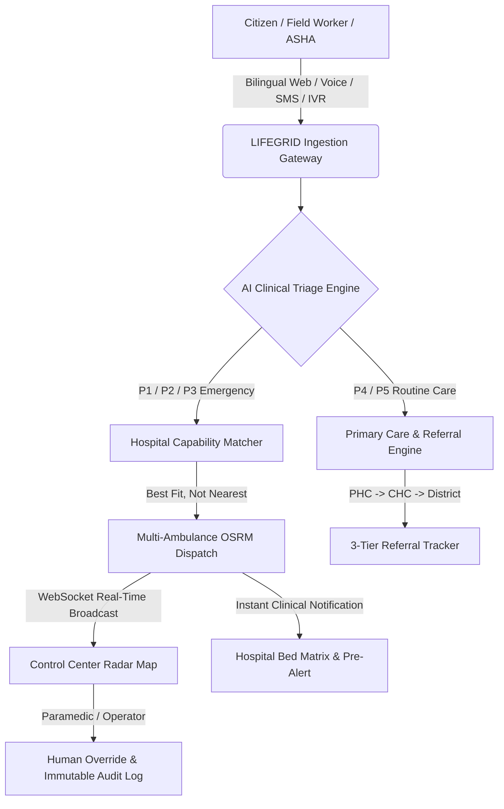

# LIFEGRID — Rural Healthcare Accessibility & Multi-Patient Emergency Coordination Engine

[](https://nodejs.org/)
[]()
[]()
[]()
[]()

> **LIFEGRID** is an institutional-grade emergency response orchestration engine and rural healthcare coordination platform built for rapid emergency dispatch, multi-casualty load balancing, AI-assisted clinical triage, real-time hospital pre-alerting, and 3-tier inter-facility referral continuity across hilly and underserved terrains (including the Himalayan state of Uttarakhand and Pan-India networks).

> 📖 **Comprehensive System Guide**: For an in-depth breakdown of all 8 modes, mathematical algorithms (Hospital matching, Multi-ambulance allocation, OSRM road curvature), and backend architecture, see **[docs/PROJECT_GUIDE.md](docs/PROJECT_GUIDE.md)**.

---

## 🌟 Architecture & Tech Stack

LIFEGRID is built with a **100% clean, ultra-fast, zero-build-step Vanilla ES6 architecture** paired with a resilient Node.js / SQLite backend:

- **Frontend Core**: Standard HTML5, CSS3, Modern Modular Vanilla JavaScript (ES6+ Modules).
- **Mapping & GIS Engine**: **Leaflet** with **OpenStreetMap Standard** tiles and **CartoDB Voyager**, featuring on-the-fly layer switching to **OpenTopoMap** (Himalayan terrain & elevation contours) and Satellite imagery with **zero third-party API key dependencies**.
- **Road Routing**: **OSRM (Open Source Routing Machine)** for real turn-by-turn road geometry, paired with algorithmic harmonic curvature fallback for disconnected nodes.
- **3D Telemetry Viewer**: **Three.js** engine for interactive 3D ambulance vehicle inspection, onboard ICU equipment diagnostics, and oxygen telemetry.
- **Real-Time State Bus**: **Socket.IO** bidirectional WebSocket channels for instant dispatch broadcasts, pre-alerts, bed availability updates, and referral status progressions.
- **Backend & Storage**: **Node.js (ESM)**, **Express 5**, **Better-SQLite3** with Write-Ahead Logging (WAL) and native Node `crypto` UUID generation.



---

## 🚀 Quick Start Guide

### Prerequisites
- [Node.js](https://nodejs.org/) (version 18.x, 20.x, or 22+ recommended)
- `npm` (bundled with Node.js)

### Installation & Launch

1. **Clone the repository and enter the directory**:
   ```bash
   git clone https://github.com/DivyankBaluni/SIH_Project.git
   cd SIH_Project
   ```

2. **Install backend dependencies**:
   ```bash
   npm install
   ```

3. **Run automated verification test suite**:
   ```bash
   npm test
   ```
   *Expected output: All 5 core verification scenarios pass successfully in < 1 second.*

4. **Start the application server**:
   ```bash
   npm start
   ```
   *Or for development with automatic server restart:*
   ```bash
   npm run dev
   ```

5. **Open in your browser**:
   - **Application Dashboard**: [http://localhost:3001/](http://localhost:3001/)
   - **Health Check**: [http://localhost:3001/health](http://localhost:3001/health)
   - **Dashboard Overview API**: [http://localhost:3001/api/dashboard/overview](http://localhost:3001/api/dashboard/overview)

---

## ⚡ Special Features

Each feature below has been implemented, validated end-to-end, and verified operational:

### 1. Multi-Casualty Fleet Allocation & Authentic OSRM Road Routing
- Simultaneously calculates required Advanced Life Support (ALS) and Basic Life Support (BLS) units for mass-casualty incidents (e.g., 2–20 casualties in highway crashes, landslides, or industrial fires).
- Fetches authentic road geometry coordinates via OSRM (`router.project-osrm.org`) for all dispatched units in parallel.
- Distributes patient cohorts across multiple designated receiving hospitals based on acute ICU bed capacity and clinical specialties.
- Multi-vehicle animated road simulation with real-time waypoint progression (`Scene Arrival` ➔ `Patient Loading` ➔ `Hospital Delivery`).

### 2. 3-Tier Clinical Facility Capability Matching ("Best Fit, Not Nearest")
- Rejects dangerous "nearest facility only" algorithms. Evaluates trauma tags, cath lab readiness, neurosurgery, stroke units, burn units, and ventilator beds.
- Penalizes facilities with zero available ICU beds or missing clinical tags, routing critical patients to the true best-fit regional super-specialty hospital.

### 3. AI-Assisted Clinical Triage with Non-Diagnostic Guardrails
- Evaluates clinical severity across P1 (Resuscitation), P2 (Emergent), P3 (Urgent), P4 (Less Urgent), and P5 (Non-urgent).
- Generates clear, non-diagnostic explainability traces for doctors and control operators.
- Strictly adheres to clinical AI safety guardrails (never uses the word "diagnosis", always labels outputs as "AI-suggested priority").

### 4. Paramedic Human-in-the-Loop Override with Append-Only Audit Logging
- Enables authorized paramedics and medical officers to override AI triage priorities with mandatory clinical justifications.
- Records all triage outputs, override events, and user IDs into an immutable, append-only SQLite `audit_logs` table.

### 5. Multi-Style High-Detail Map Radar Engine
- Crystal-clear mapping engine with zero API key dependencies and zero quota limits.
- Built-in map style switcher in the Control Center toolbar:
  - 🗺️ **OpenStreetMap Standard**: Sharp vector-rendered street and village names across India.
  - 🎨 **CartoDB Voyager**: Clean, modern high-contrast emergency operations view.
  - ⛰️ **OpenTopoMap / Relief**: Detailed topographical contours and elevation profiles, tailored for the Himalayan mountain passes of Uttarakhand.
  - 🛰️ **Satellite Imagery**: High-resolution aerial terrain.
- Interactive map pin selection for instant GPS coordinate targeting.

### 6. Bilingual Citizen Emergency Portal with Voice & GPS Tracking
- Complete Hindi (`हिन्दी`) and English bilingual interface.
- One-tap browser Speech-to-Text (`Web Speech API`) voice symptom intake.
- Step-by-step emergency wizard with real-time GPS coordinate capture.
- **Live OpenStreetMap Tracking Radar**: Displays the citizen's location, destination hospital, and dispatched ambulance moving along the road in real-time.

### 7. Real-Time Hospital Pre-Alert Console & Dynamic ICU / Bed Matrix
- Instant pre-alert feed broadcasted via WebSockets when an ambulance is dispatched towards a hospital.
- Displays patient condition, required resuscitation equipment (e.g. Cath lab, defibrillator, heparin, blood units), and live countdown ETA.
- Interactive 40-bed visual matrix with one-click toggling between Available, Occupied, and ICU states.

### 8. Interactive 3D Ambulance Telemetry & Diagnostics (Three.js)
- Detailed 3D vehicle inspection model rendered natively in WebGL using Three.js.
- Interactive orbit controls, zoom, pan, and real-time onboard telemetry (Oxygen PSI, Battery %, Equipment Checklist, Driver & Paramedic roster).

### 9. 3-Tier Rural Healthcare Referral & Continuity Tracker
- End-to-end referral workflow tracking patients across the public healthcare hierarchy:
  - **Tier 1 (Sub-Centre / PHC)**: Primary stabilization & intake.
  - **Tier 2 (CHC / Sub-District Hospital)**: Secondary intervention & diagnostics.
  - **Tier 3 (District Hospital / Medical College)**: Tertiary surgery & ICU admission.
- Carries clinical context, vitals history, and physician notes forward at every step.

### 10. Low-Connectivity / SMS & Keypad IVR Telephony Gateway
- Handles emergency dispatch when internet connectivity is degraded or absent.
- Carrier SMS keyword parser (`EMRG`, `LOC`) normalizes emergency reports and automatically generates structured outbound dispatch SMS alerts with ambulance number, hospital name, and ETA.
- Keypad IVR menu parser converts DTMF tones into triaged emergency dispatches.

---

## 🧪 Testing & Verification Matrix

The project includes an automated test suite located in `test/verify.js`:

| Test Case | Module | Description | Status |
|---|---|---|:---:|
| **Test 1** | Triage Engine | P1 Cardiac Triage & Explainability Trace with Non-Diagnostic Guardrails | **PASSED** |
| **Test 2** | Triage Engine | Incomplete Input Detection without false certainty | **PASSED** |
| **Test 3** | Hospital Matching | Hospital A vs Hospital B ("Best Fit, Not Nearest" Capability Scoring) | **PASSED** |
| **Test 4** | Audit & Governance | Paramedic Human Override & Append-Only Audit Integrity | **PASSED** |
| **Test 5** | Offline Gateway | SMS Fallback Inbound Parsing & Outbound Alert Template Generation | **PASSED** |

To execute the test suite:
```bash
npm test
```

---

## 🛠️ Identified & Resolved Bugs

During the architectural audit and verification run, the following issues were identified and resolved:
1. **Module Resolution (UUID dependency)**: Replaced external `uuid` package dependencies across backend modules with Node.js native `crypto.randomUUID`, eliminating runtime module resolution errors.
2. **Database Constraint in Incident Reporting (`incidents.channel`)**: Added safe fallback defaulting (`input.channel || 'citizen_web'`) to prevent SQLite `NOT NULL` constraint violations when reporting emergencies via the web portal.
3. **Patient Auto-Provisioning in Referrals (`referrals.patient_id`)**: Added automatic patient record creation when creating referrals from routine care forms without pre-existing patient IDs.
4. **Washed-out Map Tiles**: Replaced generic world tiles with **OpenStreetMap Standard**, **CartoDB Voyager**, and **OpenTopoMap** with an interactive map style switcher and automatic failover handling.
5. **Citizen Emergency Location Alignment**: Updated default coordinates and presets to Uttarakhand (Dehradun / Rishikesh / Chamoli / Tehri Garhwal) and embedded a live OpenStreetMap tracking radar into Step 4 of the citizen emergency workflow.

---

## 📁 Repository Structure

```
SIH_Project/
├── public/                     # Frontend Application (Vanilla ES6)
│   ├── index.html              # Main HTML5 entry point
│   ├── app.js                  # Main Application Orchestrator & Router
│   ├── app.css                 # Clean CSS3 design system & glassmorphism
│   ├── api.js                  # Centralized HTTP & WebSocket API client
│   ├── assets/vendor/          # Vendored Leaflet, Three.js & Socket.IO
│   ├── components/             # Reusable UI components
│   │   ├── ai-suggestion-badge.js
│   │   ├── ambulance-3d-viewer.js
│   │   ├── badges.js
│   │   ├── explainability-modal.js
│   │   └── override-modal.js
│   └── screens/                # Functional application views
│       ├── control-center.js       # Live dispatch radar & OSRM multi-fleet map
│       ├── citizen-emergency.js    # Bilingual emergency portal with live radar
│       ├── hospital-dashboard.js   # 40-bed matrix & pre-alert receiver
│       ├── ambulance-fleet.js      # Fleet telemetry & 3D vehicle viewer
│       ├── routine-triage.js       # Primary care guidance & ASHA workflow
│       ├── hospital-pre-alert.js   # Specialist preparation & trauma alert feed
│       ├── referral-tracker.js     # 3-tier inter-facility referral chain
│       └── offline-simulator.js    # SMS & IVR telephony testbench
├── src/                        # Backend Server (Node.js ESM)
│   ├── api/
│   │   ├── server.js           # Express 5 & Socket.IO server setup
│   │   └── routes/             # RESTful API endpoints
│   ├── db/seed/                # Uttarakhand hospital & fleet dataset seeder
│   ├── modules/                # Core domain business logic
│   │   ├── ai-engine/          # ML Triage classifier & Predictive ETA models
│   │   ├── ambulance-matching/ # Fleet capacity & class evaluator
│   │   ├── dashboard/          # Metrics aggregation engine
│   │   ├── hospital-alerting/  # Pre-alert lifecycle manager
│   │   ├── hospital-matching/  # 3-tier clinical capability matching
│   │   ├── intake/             # Incident ingestion & normalization
│   │   ├── offline-gateway/    # SMS regex parser & IVR telephony bridge
│   │   ├── pan-india/          # Uttarakhand & Pan-India dataset & OSRM router
│   │   ├── referral/           # Referral continuity & follow-up scheduler
│   │   ├── route-optimization/ # Signal priority & corridor routing
│   │   └── triage/             # AI clinical triage engine & override handler
│   └── shared/                 # Database, RBAC, and Audit infrastructure
├── test/
│   └── verify.js               # Automated scenario verification suite
├── package.json
└── README.md
```

---

## 📜 License & Acknowledgments
LIFEGRID was developed for the Smart India Hackathon (SIH) under the Rural Healthcare Accessibility & Emergency Coordination theme.
- OpenStreetMap & CARTO for geographic tile data.
- OSRM (Open Source Routing Machine) for road geometry routing.
- Three.js for 3D graphics acceleration.